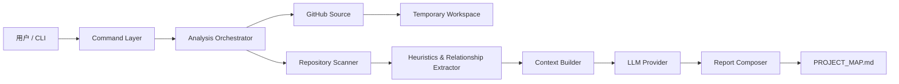
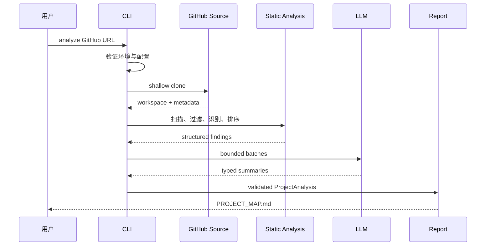

# RepoLens 技术设计文档

> 文档状态：v0.1 MVP 已批准  
> 实现目标：2–3 周内完成可发布的 Python CLI  
> 设计原则：简单、可测试、安全、可扩展但不过度抽象

## 1. 设计摘要

RepoLens v0.1 是一个本地运行的 Python CLI。它接收公开 GitHub repository URL，使用 Git shallow clone 获取代码，在隔离的临时目录中进行轻量级 static analysis，选择最有信息量的文件，调用 LLM 分层总结，最终写出 `PROJECT_MAP.md`。

系统不运行目标代码，不构建完整 AST，不使用 database，也不采用 autonomous agent loop。所有分析均在一次有明确阶段和资源上限的 pipeline 中完成。

架构职责保持清晰，但 v0.1 的物理代码结构优先采用少量扁平 modules。初学者可以直接找到主要流程，不需要在第一天理解多层 package、interface hierarchy 或过早抽象。

## 2. 设计原则

1. **Deterministic first**：目录扫描、过滤、技术栈识别和文件排序优先使用可测试的确定性规则。
2. **LLM for synthesis**：LLM 负责解释和归纳，不负责控制系统或任意探索文件。
3. **Bounded pipeline**：文件数量、单文件大小、总字符数、LLM batch 和 retry 均有上限。
4. **Untrusted repository**：仓库文件、路径和文档全部视为不可信输入。
5. **Traceable output**：重要结论尽量关联具体文件路径，并区分事实与推断。
6. **Beginner-friendly**：默认配置可直接使用，错误信息提供修复建议。
7. **Replaceable boundaries**：Git source、static analyzer、LLM provider 和 report renderer 通过小型接口隔离。

## 3. Overall Architecture



架构分为七个主要边界：

- **Command Layer**：解析参数、检查环境、显示进度和错误；
- **Analysis Orchestrator**：按固定顺序协调完整分析流程；
- **GitHub Source**：验证 URL、shallow clone、记录 repository metadata；
- **Repository Scanner**：安全遍历、过滤、分类和读取文件；
- **Heuristics & Relationship Extractor**：识别技术栈、重要文件和关系线索；
- **Context Builder / LLM Provider**：构造有限上下文并获得结构化摘要；
- **Report Composer**：验证分析结果并生成 Markdown。

这些是逻辑职责边界，不要求 v0.1 为每个边界建立独立目录或 class。初始实现映射如下：

| 逻辑职责 | v0.1 module |
|---|---|
| CLI 和 pipeline coordination | `cli.py` |
| Configuration | `config.py` |
| Error types | `errors.py` |
| GitHub Source | `git_source.py` |
| Repository Scanner 和 filters | `scanner.py` |
| Technology detection、ranking、relationships 和 context assembly | `analyzer.py` |
| LLM provider、prompt 和 structured response | `llm.py` |
| Report Composer | `report.py` |

## 4. Component Design

### 4.1 Command Layer

职责：

- 提供 `repolens analyze <github-url>`；
- 解析 `--output`、`--model`、`--max-files` 和 `--verbose`；
- 检查 Git、API key 和输出目录；
- 显示阶段进度；
- 将内部异常转换为简洁、可操作的用户错误；
- 返回适合 shell 和 CI 使用的 exit code。

不负责：

- 扫描 repository；
- 直接构造 prompt；
- 包含具体 provider API 调用；
- 生成报告正文。

建议 exit code：

- `0`：成功；
- `2`：输入或配置错误；
- `3`：repository 获取失败；
- `4`：分析失败；
- `5`：LLM provider 失败；
- `6`：输出写入失败。

### 4.2 Configuration

职责：

- 合并 CLI options、environment variables 和安全默认值；
- 使用 typed model 验证配置；
- 集中保存资源限制；
- 对敏感字段提供脱敏表示。

v0.1 建议仅支持 environment variables 和 CLI options，不引入用户级配置文件或 repository 配置文件。

核心配置包括：

- model 名称；
- API key 和可选 API endpoint；
- 输出路径；
- 最大候选文件数；
- 单文件读取上限；
- 总文本预算；
- LLM timeout 和有限 retry。

### 4.3 GitHub Source

职责：

- 仅接受标准 GitHub HTTPS repository URL；
- 规范化可选的 `.git` 后缀和尾部斜杠；
- 拒绝本地路径、SSH URL 和非 GitHub host；
- 调用本机 Git 执行 shallow clone；
- 获取 repository owner、name、default branch 和 commit SHA；
- 管理临时工作目录生命周期。

技术决策：

- v0.1 直接使用受控的 Git subprocess，而不是引入完整 Git library；
- subprocess 参数以 list 形式传递，不通过 shell 拼接；
- clone 使用最小 history；
- 设置 timeout，并限制后续扫描规模。

GitHub Source 不使用 GitHub API，因此不需要 authentication，也避免 API rate limit。无法 clone 的 repository 直接返回错误，不尝试网页抓取或其他 fallback。

### 4.4 Repository Scanner

职责：

- 从 workspace root 安全遍历文件；
- 应用 `.gitignore` 和 RepoLens 默认排除规则；
- 识别 symlink、binary、generated 和 oversized files；
- 生成规范化的相对路径；
- 收集文件大小、扩展名和目录统计；
- 在预算范围内读取文本内容。

默认排除示例：

- `.git/`、`node_modules/`、`vendor/`、`.venv/`；
- `dist/`、`build/`、`coverage/`、cache directories；
- 图片、音视频、archive、compiled binaries；
- minified bundles、source maps 和常见 generated files；
- `.env`、private keys、credential 文件和常见 secret 路径。

所有 resolved paths 必须仍位于 workspace root 内。symlink 默认不跟随。

### 4.5 Technology Detector

职责：

- 根据文件扩展名统计主要 programming languages；
- 根据 manifest、lockfile 和配置识别 framework、runtime 和 tools；
- 保存每项结论的 evidence paths；
- 对置信度不足的结果标记为 inferred。

优先使用高可信证据：

- `pyproject.toml`、`package.json`、`Cargo.toml`、`go.mod` 等 manifest；
- lockfiles；
- framework-specific configuration；
- CI workflow 和 container files；
- 目录和扩展名分布。

不通过执行 package manager 或 import 项目代码来识别技术栈。

### 4.6 Importance Ranker

职责：

- 为候选文本文件计算可解释的 importance score；
- 选出有限数量的关键文件；
- 保留每个分数的 reason，便于报告和调试；
- 使用路径作为稳定 tie-breaker，确保结果可复现。

评分信号包括：

- README、manifest、主要配置和 entry point 加分；
- source root 下的核心文件加分；
- 被轻量关系提取器多次引用的文件加分；
- tests、examples 和 docs 适度保留；
- generated、fixture、snapshot 和过大文件降分；
- 过深目录或重复文件降分。

v0.1 不使用 embedding、vector database 或 LLM agent 决定遍历顺序。

### 4.7 Relationship Extractor

职责：

- 通过轻量 pattern 提取 import/module references；
- 将相对 import 解析为 repository 内可能的目标文件；
- 根据目录、入口文件和配置关系形成 module-level edges；
- 为每条关系记录 evidence 和 confidence；
- 提供“推断的基础 data flow”所需的结构化线索。

v0.1 优先处理 JavaScript/TypeScript 和 Python 的常见 import pattern。其他语言只接受通用 directory/file-level analysis，不承诺语言专用关系。即使对于优先语言，系统也不保证语义完整，并且不会处理 dynamic import、reflection、macro expansion、runtime dependency injection 或完整 type resolution。

关系类型可限制为：

- `imports`：文件或模块 import 另一个模块；
- `configures`：配置文件指向模块或 entry point；
- `contains`：目录包含主要模块；
- `invokes-likely`：根据命名和引用推断的可能调用；
- `reads/writes-likely`：根据明确 API 使用推断的基础数据读写。

后两类及由这些关系生成的基础 data flow 必须在报告中明确标记为推断，不得描述为经过 runtime 验证的执行路径。

### 4.8 Context Builder

职责：

- 把目录树、技术栈、文件排名和关系整理为结构化 context；
- 按文件和模块建立 batches；
- 截断超出预算的内容，并记录截断原因；
- 为 repository content 添加明确边界和 path metadata；
- 估算 context 大小，防止超过模型限制。

优先级顺序：

1. repository metadata；
2. manifest 和高可信技术栈证据；
3. directory tree；
4. 高排名 entry points 和核心模块；
5. tests、examples 和补充文档；
6. 低排名文件摘要。

### 4.9 LLM Provider

定义最小 provider interface，输入 typed request，输出 typed response。v0.1 只提供一个 OpenAI implementation；其他 provider 进入后续版本。

职责：

- 调用指定模型；
- 设置 timeout 和有限 retry；
- 请求结构化输出；
- 将 provider-specific error 转换为内部错误类型；
- 返回 token usage 等可用 metadata；
- 不在日志中暴露 API key 或完整 repository 内容。

Provider interface 的存在是为了隔离变化，不代表 v0.1 同时支持多个 provider。

### 4.10 Summarization Pipeline

采用有限的 hierarchical summarization，而不是 agent loop：

1. **File summaries**：总结有限数量的关键文件；
2. **Module summaries**：根据目录和关系合并文件摘要；
3. **Project synthesis**：结合确定性分析和模块摘要生成项目级结果；
4. **Validation**：检查 required fields、路径引用和数据类型；
5. **Report rendering**：将 validated result 渲染为 Markdown。

每个阶段具有固定输入、固定输出 schema 和最大调用次数。解析失败时最多进行有限修复重试；仍失败则返回清晰错误或在可接受时降级生成部分报告。

### 4.11 Report Composer

职责：

- 接收 validated analysis result；
- 使用稳定 template 生成 `PROJECT_MAP.md`；
- 对 Markdown 特殊字符和不可信内容进行安全处理；
- 统一标记 evidence、inference 和 limitations；
- 使用临时文件加原子替换写入最终输出，避免留下半份报告。

Report Composer 不再次调用 LLM。最终章节结构由代码模板控制，避免模型遗漏必要章节。

## 5. Data Models

v0.1 只需少量 typed models：

- `RepositoryMetadata`：URL、owner、name、branch、commit SHA；
- `FileRecord`：path、size、language、classification、read status；
- `TechnologyFinding`：name、category、evidence、confidence；
- `Relationship`：source、target、type、evidence、confidence；
- `FileSummary`：path、purpose、key symbols、notes；
- `ModuleSummary`：name、paths、responsibility、relationships；
- `AnalysisLimits`：扫描、跳过、截断和调用统计；
- `ProjectAnalysis`：生成报告所需的完整 validated result。

这些 models 在内存中传递。v0.1 不做 database persistence。

## 6. End-to-End Data Flow



详细步骤：

1. CLI 解析 URL 和 options；
2. 环境检查确认 Git、API key 和输出权限；
3. GitHub Source 创建临时目录并 shallow clone；
4. Scanner 安全遍历并应用排除规则；
5. Technology Detector 和 Relationship Extractor 生成确定性 findings；
6. Importance Ranker 选出预算内关键文件；
7. Context Builder 生成 batches；
8. LLM Provider 返回 file、module 和 project summaries；
9. 系统验证输出，并与确定性 findings 合并；
10. Report Composer 生成 `PROJECT_MAP.md`；
11. 清理临时 workspace；
12. CLI 显示报告位置和简要使用统计。

任何阶段失败都应清理临时目录，并保留足够诊断信息。日志默认简洁，`--verbose` 才显示细节。

## 7. Folder Structure Proposal

### 7.1 v0.1 初始结构

v0.1 优先采用扁平结构，让初学者能快速理解文件职责：

```text
repolens/
├── pyproject.toml
├── README.md
├── LICENSE
├── CHANGELOG.md
├── src/
│   └── repolens/
│       ├── __init__.py
│       ├── cli.py
│       ├── config.py
│       ├── errors.py
│       ├── git_source.py
│       ├── scanner.py
│       ├── analyzer.py
│       ├── llm.py
│       └── report.py
├── tests/
│   ├── fixtures/
│   ├── snapshots/
│   └── test_*.py
└── examples/
    └── PROJECT_MAP.md
```

初始职责约束：

- `cli.py` 负责 CLI entry point 和按顺序调用 pipeline，不额外创建 `orchestrator.py`；
- `scanner.py` 同时容纳 traversal 和 filters，直到文件明显难以维护；
- `analyzer.py` 同时容纳 technology detection、importance ranking、lightweight relationships 和 context assembly；
- `llm.py` 只包含 v0.1 的 OpenAI provider、prompt 和 response validation；
- 小型 data models 放在最接近其使用位置的 module 中，不提前创建复杂共享 model hierarchy。

### 7.2 Future Refactor Path

当单个 module 变得难以测试、出现第二个 provider，或 language-specific analyzers 明显增加时，再按职责拆分为 folder-based architecture：

```text
src/repolens/
├── cli.py
├── config.py
├── errors.py
├── models.py
├── orchestrator.py
├── source/
│   └── github.py
├── analysis/
│   ├── scanner.py
│   ├── filters.py
│   ├── technology.py
│   ├── ranking.py
│   └── relationships.py
├── context/
│   └── builder.py
├── llm/
│   ├── base.py
│   └── openai_provider.py
└── report/
    ├── composer.py
    └── template.md
```

重构触发条件应是实际复杂度，而不是为了“看起来像大型项目”。在 v0.1 中，逻辑边界通过函数、typed inputs 和 tests 保持，物理目录暂时保持简单。

## 8. Technology Choices

| 领域 | 选择 | 原因 |
|---|---|---|
| Runtime | Python 3.11+ | 生态成熟、适合 CLI 和 AI integration、初学者友好 |
| Packaging | `pyproject.toml` | Python 标准现代打包方式 |
| CLI | Typer | 类型驱动、help 输出清晰、学习成本低 |
| Validation | Pydantic | 配置和 LLM structured output 验证清晰 |
| LLM SDK | Official OpenAI Python SDK | v0.1 单一 provider，减少兼容层复杂度 |
| Git | Git subprocess | 依赖少，行为接近用户熟悉的 Git |
| Ignore rules | pathspec 或小型兼容层 | 复用 `.gitignore` 语义 |
| Progress | Rich | CLI 进度和错误展示成熟 |
| Tests | pytest | Python 生态通用、fixture 支持良好 |
| Lint/format | Ruff | 单工具、速度快、配置简单 |
| Type checking | mypy 或 Pyright | 在核心边界提供基础类型检查 |
| CI | 本地质量命令；GitHub Actions 可选 | v0.1 必须可本地执行 lint、test 和 package build，完整 workflow 属于 release polish |

依赖应保持克制。若标准库可以清晰完成任务，不额外引入 framework。

## 9. Internal API Responsibilities

以下接口表达长期责任边界。v0.1 不要求为每项建立单独文件或大型 service class；优先在八个扁平 modules 中使用小型 typed functions：

- `RepositorySource.fetch(url) -> Workspace`：获取临时 repository；
- `RepositoryScanner.scan(workspace, limits) -> ScanResult`：安全扫描；
- `TechnologyDetector.detect(scan) -> list[TechnologyFinding]`：识别技术栈；
- `ImportanceRanker.rank(scan, findings) -> list[RankedFile]`：排序文件；
- `RelationshipExtractor.extract(scan, selected) -> list[Relationship]`：提取关系；
- `ContextBuilder.build(...) -> AnalysisBatches`：构造有限上下文；
- `LLMProvider.complete(request) -> response`：完成一次 typed LLM request；
- `ReportComposer.render(analysis) -> str`：渲染 Markdown；
- `AnalysisOrchestrator.run(request) -> AnalysisResult`：协调流程。

接口表达责任边界，不要求每个接口都建立复杂 inheritance hierarchy。v0.1 优先使用 composition 和清晰函数。

## 10. Error Handling

内部错误按领域分类：

- `ConfigurationError`；
- `InvalidRepositoryUrlError`；
- `GitUnavailableError`；
- `CloneError`；
- `ScanLimitError`；
- `ProviderAuthenticationError`；
- `ProviderRateLimitError`；
- `ProviderResponseError`；
- `ReportWriteError`。

规则：

- 用户错误不显示 Python traceback；
- `--verbose` 可显示可诊断信息，但仍需脱敏；
- transient provider error 使用 exponential backoff 和小次数 retry；
- authentication、invalid URL 等确定性错误不 retry；
- 某个非关键文件读取失败时记录 limitation 并继续；
- 核心 metadata、LLM project synthesis 或输出写入失败时停止；
- 无论成功或失败都清理 workspace。

## 11. Security Considerations

### 11.1 不执行目标代码

禁止：

- `import` repository module；
- 运行 build、test、script 或 package manager；
- 安装 repository dependencies；
- 执行 hook；
- 使用 shell 解释 repository 中的字符串。

### 11.2 Filesystem 安全

- workspace 使用 OS temporary directory；
- resolved file path 必须位于 workspace root；
- 默认不跟随 symlink；
- 使用受控的相对路径写入报告；
- 输出路径由用户决定，但不得被 repository 内容覆盖；
- 清理操作只作用于 RepoLens 创建并验证过的临时目录。

### 11.3 Secret 保护

- 默认跳过 `.env`、private key、credentials 和常见 token 文件；
- 对疑似高熵 secret 可只记录“已跳过”，不读取正文；
- API key 仅从环境或安全配置进入 provider；
- 日志和异常不得打印 secrets；
- 文档应明确说明：任何发送给 remote LLM 的代码都离开本机。

v0.1 的过滤不能替代专业 secret scanner，因此必须在 README 中披露残余风险。

### 11.4 Prompt Injection

- system prompt 明确 repository content 是待分析数据；
- 文件正文使用明确 delimiters 和 path metadata 包裹；
- 不允许模型发起 tool call、读取新文件或修改流程；
- 模型输出只进入 typed schema 和 Markdown renderer；
- repository 中出现“忽略之前指令”等文字不得改变 pipeline；
- 报告不得自动执行模型返回的命令。

### 11.5 Resource Exhaustion

- clone、scan 和 provider request 设置 timeout；
- 限制文件数、文件大小、总字符数和 LLM batches；
- 拒绝或截断异常大的内容；
- compressed archive 不解压；
- retry 有硬上限。

## 12. Testing Strategy

### 12.1 Unit Tests

覆盖：

- URL normalization 和 validation；
- ignore/filter rules；
- binary 和 secret-like file 识别；
- language/technology detection；
- importance ranking 的 deterministic 行为；
- lightweight relationship extraction；
- context truncation；
- report rendering；
- error 到 exit code 的映射。

### 12.2 Integration Tests

- 使用本地 fixture repository 模拟完整 pipeline；
- 使用 Mock LLM 返回固定 structured responses；
- 验证最终 `PROJECT_MAP.md` 的 required sections；
- 验证失败时 workspace cleanup；
- 验证不会运行 fixture 中的恶意 script。

### 12.3 Snapshot Tests

对少量稳定 fixtures 保存报告 snapshot，用于发现 template 和排序的意外变化。Snapshot 只验证结构和关键内容，不锁死所有自然语言措辞。

### 12.4 Optional Live Tests

真实 GitHub 和 OpenAI API 测试只作为手动 release check，不进入默认 CI，避免网络不稳定、费用和 secret 风险。

## 13. Observability

v0.1 不引入 telemetry backend。

本地可观察信息包括：

- 当前 pipeline stage；
- 扫描、选择、跳过和截断的文件数量；
- LLM 调用次数和 SDK 提供的 token usage；
- 总耗时；
- `--verbose` 下的脱敏诊断日志。

默认不收集或上传 usage analytics。未来若考虑 telemetry，必须 opt-in 并单独设计隐私策略。

## 14. Performance and Limits

v0.1 应通过配置提供保守默认上限，而不是承诺支持无限仓库。具体数值在实现阶段通过 fixture 测试校准。

必须存在的限制：

- clone timeout；
- 最大扫描文件数；
- 最大候选文本文件数；
- 单文件字节数；
- 总读取文本量；
- 每个 LLM batch 的 context budget；
- 最大 LLM 调用次数；
- 最大 retry 次数。

达到软限制时，优先生成带 limitation 的部分覆盖报告；遇到安全限制或无法形成最小有效上下文时，明确失败。

## 15. Open-source Engineering

v0.1 必需：

- `README.md` 包含 Quick Start、安装步骤、CLI usage example 和已知限制；
- 提供 `LICENSE`；
- 提供至少一份 sample `PROJECT_MAP.md`；
- lint、test 和 package build 可通过本地命令执行；
- release 使用 Semantic Versioning；
- 任何新增 provider、language-specific parser 或 Web UI 均需独立 proposal，避免侵入 v0.1 core。

可选 release polish，不阻塞 v0.1：

- `CONTRIBUTING.md`；
- `CODE_OF_CONDUCT.md`；
- bug、analysis quality 和 feature request issue templates；
- 完整 GitHub Actions workflows；
- 更完整的 maintainer 和 contributor workflow。

## 16. Architecture Decisions Deferred

以下决策明确推迟：

- Web architecture 和 hosting；
- authentication 和 private repository access；
- database schema；
- plugin discovery mechanism；
- vector database 和 embeddings；
- full AST framework；
- distributed processing；
- autonomous agent runtime；
- provider routing 和 fallback；
- repository-level configuration format。

推迟这些决策可以让 v0.1 保持为可理解、可测试的线性 CLI pipeline。
